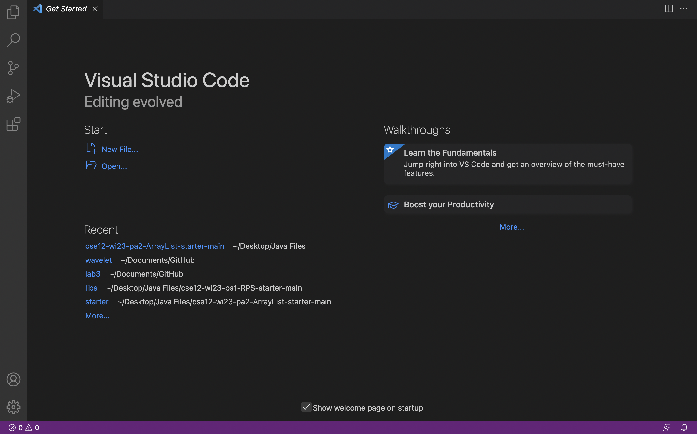
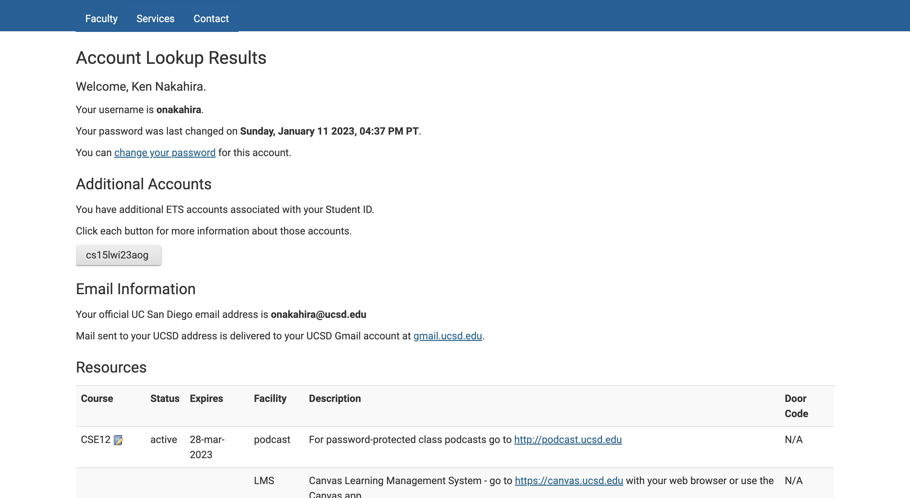
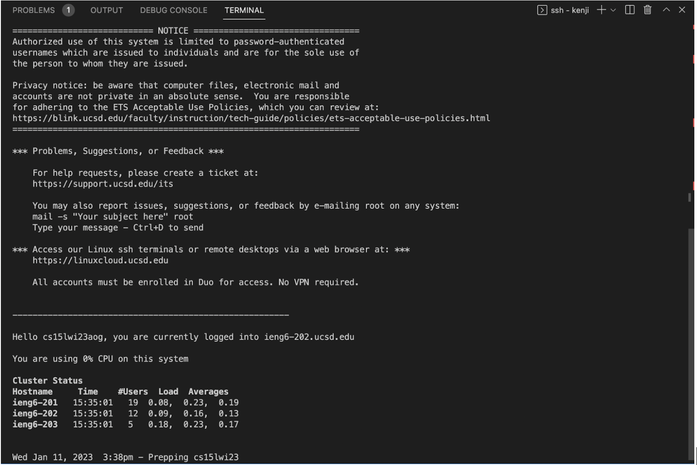

# How to establish remote access on your laptop for CSE15L.
## Step 1: Installing Visual Studio Codes
Our very first step to connecting your laptop to the lab computers is to install VSCode on your computer. This will be your activities hub for coding. 

Go to [https://code.visualstudio.com/](https://code.visualstudio.com/) and download the whichever installer you need for you OS. The installation is very straightforward and should give no issues. Once it's finished downloading we'll move on to establishing remote accesss. Here's what the screen should look like once it's downloaded:



## Step 2: Finding Your Username
Congratulations! You've made it to the most **crucial** step. There is something to do, however, if you're on **Windows**; Mac users can skip this step. To ensure that everything works properly, install git for Windows:

[Git for Windows](https://gitforwindows.org/)

Once that is done, follow the steps in [this post](https://stackoverflow.com/a/50527994) to set your terminal in VSCode to use *git bash*.

Welcome back Mac users. We're getting closer to connecting to the lab computers. But first, you need to find your course-specific account in order to log in. Go to [this page](https://sdacs.ucsd.edu/~icc/index.php) and look up your username. Once your have your username, you'll need to reset the password for your account, here's the tutorial: [[TUTORIAL] How to Reset your Password](https://docs.google.com/document/d/1hs7CyQeh-MdUfM9uv99i8tqfneos6Y8bDU0uhn1wqho/edit).


Click the button under additional account and change your password from there.

When you have your username and password then you're ready to connect.

## Step 3: Remote Connection
Now it's time to connect remotely. Open up a terminal in your VSCode and type in the following command `ssh cs15lwi23xx@ieng6.ucsd.edu` and replacing the `xx` with the letters in your own username you looked up. As this is most likely your first time connecting to the server, you'll see this authentication message: 

```
The authenticity of host 'ieng6.ucsd.edu (128.54.70.227)' can't be established. 
RSA key fingerprint is SHA256:ksruYwhnYH+sySHnHAtLUHngrPEyZTDl/1x99wUQcec. 
Are you sure you want to continue connecting (yes/no/[fingerprint])?
```

Just say yes and you'll be prompted to enter your password to connect.

After your enter your password, your terminal should look like this: 



Once you see this, your laptop has successfully connected to the lab computers.

## Step 4: Trying Some Commands
Now that we have the remote connection up and running, it's time to try out some commands. 
Here are some commands to try out:
* `cd ~` change directory to the home directory 
* `ls -lat` displays all files in long form by modification time
* `ls -a` displays all files in the current directory
* `cat /home/linux/ieng6/cs15lwi23/public/hello.txt` displays the content of the file hello.txt

Here's an example of me running some different commands and the display:


Once you finish running commands and want to exit the remote server, run `exit` or just Ctrl-D.

Congrats! You've just learned how to connect to lab computers and run simple commands via your personal laptop.
