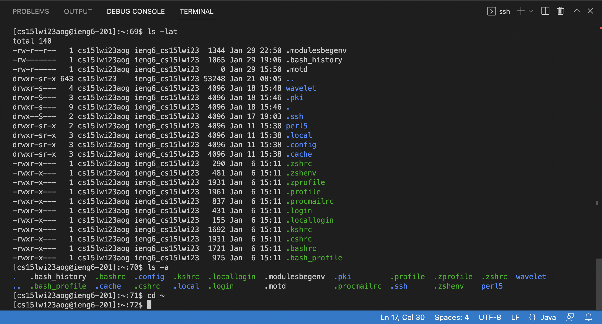

# How to establish remote access on your laptop for CSE15L.
## Step 1: Installing Visual Studio Codes
Our very first step to connecting your laptop to the lab computers is to install VSCode on your computer. This will be your activities hub for coding. 

Go to [https://code.visualstudio.com/](https://code.visualstudio.com/) and download the whichever installer you need for you OS. I won't be providing any screenshots for this step as I already have VSCode installed on my laptop. The installation is very straightforward and should give no issues. Once it's finished downloading we'll move on to establishing remote accesss.

## Step 2: Finding Your Username
Congratulations! You've made it to the most **crucial** step. There is something to do, however, if you're on **Windows**; Mac users can skip this step. To ensure that everything works properly, install git for Windows:

[Git for Windows](https://gitforwindows.org/)

Once that is done, follow the steps in [this post](https://stackoverflow.com/a/50527994) to set your terminal in VSCode to use *git bash*.

Welcome back Mac users. We're getting closer to connecting to the lab computers. But first, you need to find your course-specific account in order to log in. Go to [this page](https://sdacs.ucsd.edu/~icc/index.php) and look up your username. Once your have your username, head over to VSCode and open up a terminal to connect to the lab computers.

## Step 3: Remote Connection
Now it's time to connect remotely. Open up a terminal in your VSCode and type in the following command `ssh cs15lwi23xx@ieng6.ucsd.edu` and replacing the `xx` with the letters in your own username you looked up. After your enter your password, your terminal should look like this: 

Once you see this, your laptop has successfully connected to the lab computers.

## Step 4: Trying Some Commands
Now that we have the remote connection up and running, it's time to try out some commands. 
Here are some commands to try out:
* `cd ~`
* `ls -lat`
* `ls -a`
* `cat /home/linux/ieng6/cs15lwi23/public/hello.txt`

Here's an example of me running `ls -a`, which displays all files, including hidden ones, inside the current directory:

